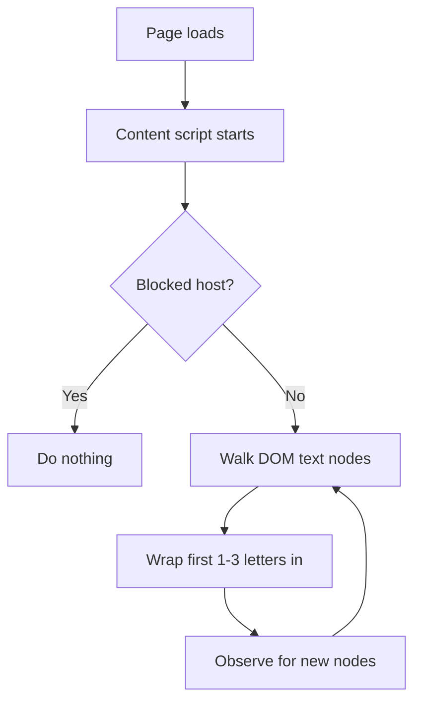

# BoldStart Reader (Chrome Extension)

This extension bolds the first 1 or 3 letters of each word on a web page. The idea is to create visual "fixation points" that some readers find easier to scan.

## How it works
- A content script walks the page DOM and finds plain text nodes.
- It skips sensitive or non-readable elements like `script`, `style`, `input`, `textarea`, `code`, `pre`, and editable fields.
- For each word, it wraps the first 1 or 3 characters in a `` with `font-weight: bold`.
- It observes the page for new content and applies the same transformation.
- A built-in blocklist prevents the extension from running on banking/finance sites.

## Privacy and data handling
- There are **no network requests**.
- Allowlist is stored **locally** in Chrome (no sync).

## About the technique
This approach is often referred to as **Bionic Reading** (or bionic text). It is popular as a reading aid, including among neurodivergent readers, but peer‑reviewed evidence so far does **not** show consistent improvements in reading speed or comprehension for general populations. Research specifically on neurodivergent groups is still limited. Consider it a personal‑preference aid rather than a proven improvement.

## Deploy (local)
1. Clone the repo: `git clone <repo-url> /path/to/highlighter`
2. Open Chrome and go to `chrome://extensions`.
3. Enable **Developer mode**.
4. Click **Load unpacked** and select the repo folder.

To update after changes, click **Reload** on the extension card in `chrome://extensions`.

## Quick update
- After pulling new changes, click **Reload** on the extension card.

## Toggle (no storage)
- Click the extension icon to toggle on/off for the active tab.
- Hotkey: `Alt+B` (Windows/Linux) or `Command+B` (macOS).
- Badge shows `ON` (green) or `OFF` (red) per tab.

## Fort Knox + allowlist mode
- Runs **only when you explicitly toggle it on** for the current tab.
- Only works on **allowlisted** sites.
- Uses **`activeTab`** permission so it can only access a site after a user action.
- No auto‑injection on navigation; refresh resets to off.
- Right‑click the extension icon to add/remove the current site from the allowlist.

## Customize the blocklist
Edit the `BLOCKED_HOSTS` array in `/Users/tutis/repos/highlighter/src/content/index.js` to add or remove domains.
