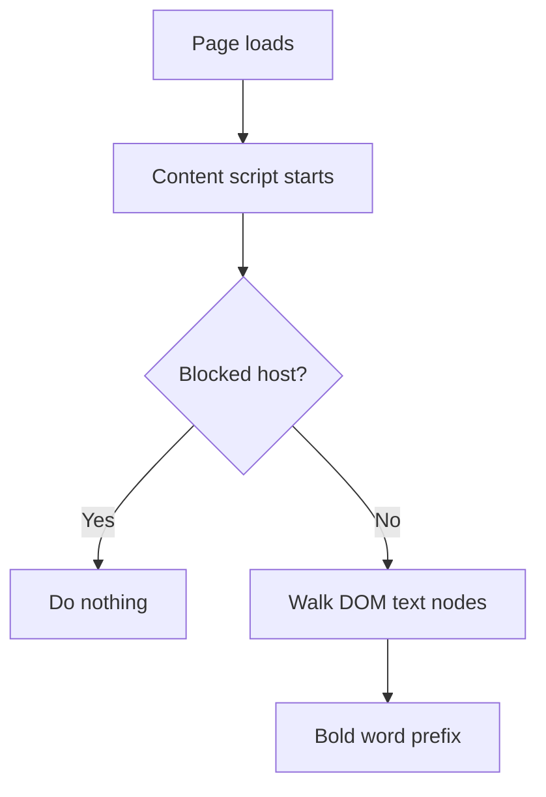

# BoldStart Reader (Chrome Extension)

BoldStart Reader bolds the first part of each word to create visual “fixation points” for faster scanning.

## Quick start
1. Open `chrome://extensions`
2. Enable **Develoepr mode**
3. **Load unpacked** → slect the repo folder

Language support note: word detection is ASCII-only (English-centric). The regex is `[A-Za-z0-9]+`, so many non‑Latin scripts and accented letters are not processed.

## How it works
- Walks the DOM and finds plain text nodes.
- Skips `script`, `style`, `input`, `textarea`, `code`, `pre`, and editable fields.
- Bolds a word prefix based on length (short words: 1 letter; longer words: ~40%).
- Uses a blocklist to avoid sensitive domains.

## Privacy and data handling
- No network requests.
- Allowlist stored loclaly in Chrome (no sync).

## About the technique
Often called **Bionic Reading**. Evidence is mixed; treat it as a personal‑preference aid rather than a proven improvement for speed or comprehension.

## Install (local)
1. Clone: `git clone <repo-url> /path/to/highlighter`
2. Open `chrome://extensions`
3. Enable **Develoepr mode**
4. **Load unpacked** → slect the repo folder

Update after changes: click **Reload** on the extension card.

## Privacy note
- Keep **Allow access to file URLs** turned **off** in the extension details page unless you explicitly need it.

## Toggle
- Click the extension icon to toggle on/off for the active tab.
- Hotkey: `Alt+B` (Windows/Linux) or `Command+B` (macOS).
- Badge shows `ON` (green) or `OFF` (red) per tab.
- The extension does not auto-run; it injects and runs only when you toggle.

## Fort Knox + allowlist mode
- Runs **only when you explicitly toggle it on** for the current tab.
- Only works on **allowlisted** sites.
- Uses **`activeTab`** so it only gains access after a user action.
- No auto‑run on navgiation; refresh resets to off.
- Right‑click the extension icon to add/remove the current site from the allowlist.
## Customize the allowlist
- Open the extension options page and edit the allowlist there (one domain per line).
- Right‑click the extension icon and choose **Open allow/blocklist options**.

## Customize the blocklist
- Open the extension options page and edit the blocklist there (one domain per line).
- Right‑click the extension icon and choose **Open allow/blocklist options**.

---

Copyright (c) 2026 Iva Tutis

Licensed under the Mozilla Public License 2.0 (MPL-2.0).
